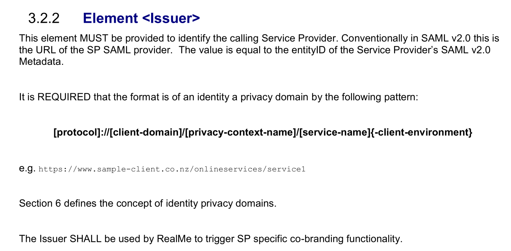
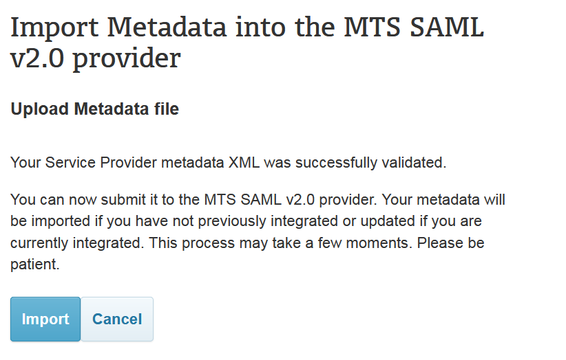
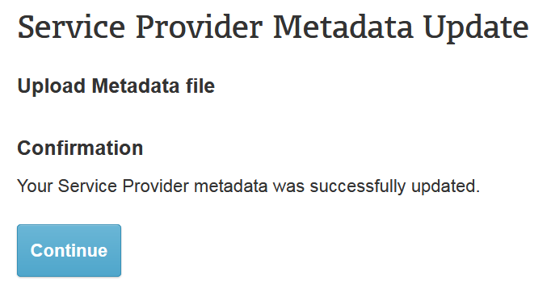
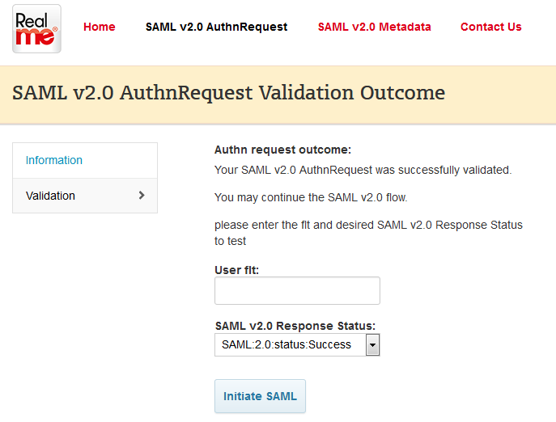
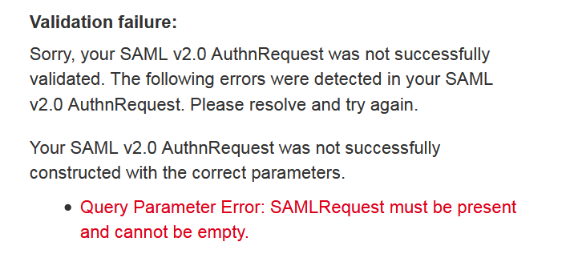
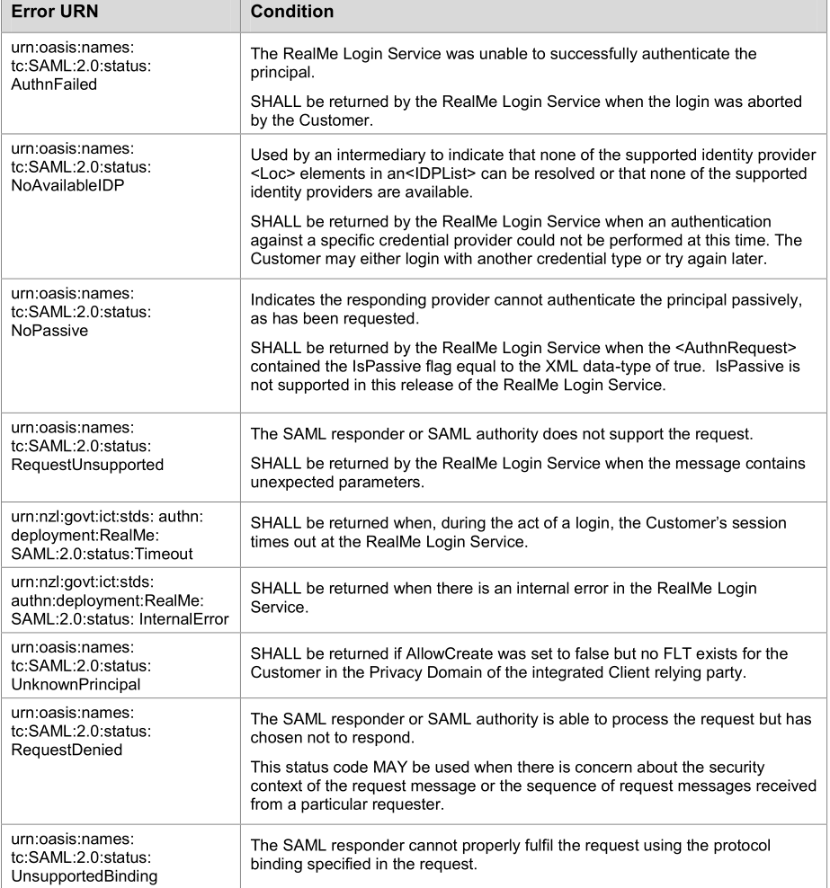

# Realme的Login接入过程记录

## 1.问题的提出

近期要使用Realme作为第三方接入，因为研究了一下Realme的请求过程（Request）和响应（Response），其中包含了一些加密和解密的方式。我们接下来分别从Request和Response两个方面进行讲述。

## 2.向Realme提交metadata

### 2.1根据模版修改sp-metadata.xml文件

我们在接入Realme之前，首先要向Realme平台提交我们的信息，其实就相当于把我们的应用注册到Realme。

我们可以从[https://developers.realme.govt.nz/assets/Uploads/Integration-Bundle-MTS-V2.1.zip](https://developers.realme.govt.nz/assets/Uploads/Integration-Bundle-MTS-V2.1.zip)下载相关的资源包。

我们以资源包中的MTSSP_PostBinding_Sample.xml作为模版进行修改，需要修改以下几个项目：

(1)**entityID**

	entityID: http://realme.test/mts2/sp

这个是我们接触Realme的唯一标识符，也就是ID。根据RealMe Messaging Specification Login V1.0.pdf第3.2.2 Element <Issuer>小节的说明：

entityID的值应该和AuthnRequest的Issuer的格式一致，Issuer格式要求请查询：[https://developers.realme.govt.nz/how-realme-works/realme-request-parameters/#login-service-authentication-request](https://developers.realme.govt.nz/how-realme-works/realme-request-parameters/#login-service-authentication-request)

(2)**Location**

	<md:AssertionConsumerService Binding="urn:oasis:names:tc:SAML:2.0:bindings:HTTP-POST" Location="https://qacand.sflab.ondemand.com/saml2/SAMLAssertionConsumer?company=hmcscindiaec" index="0" isDefault="true" />

location属性就是IDP返回结果的时候，我们的服务器的接收地址，所以这个必须是公网可以访问的地址，不能使用内网的地址。
我们的配置如下：

	<md:AssertionConsumerService Binding="urn:oasis:names:tc:SAML:2.0:bindings:HTTP-POST" Location="http://52.198.228.221/post.php" index="0" isDefault="true" />

(3)**Organization**

	<md:Organization>
		<md:OrganizationName xml:lang="en-us">
			Sample Service Provider
		</md:OrganizationName>
		<md:OrganizationDisplayName xml:lang="en-us">
			Sample Service Provider
		</md:OrganizationDisplayName>
		<md:OrganizationURL xml:lang="en-us">
			http://52.198.228.221/
		</md:OrganizationURL>
	</md:Organization>

这几个参数都是机构名称、机构显示名称、机构的URL这些参数，可以根据情况随便填。

(4)**ContactPerson**

	<md:ContactPerson contactType="technical">
		<md:Company>cloes</md:Company>
		<md:GivenName>cloes</md:GivenName>
		<md:SurName>375600284@qq.com</md:SurName>
	</md:ContactPerson>

这些是联系人信息，也可以根据情况随便填

一个完整的SP-metadata.xml例子如下：

	<md:EntityDescriptor ID="MTS SP" entityID="http://myrealme.test/mts2/sp" xmlns:ds="http://www.w3.org/2000/09/xmldsig#" xmlns:md="urn:oasis:names:tc:SAML:2.0:metadata" xmlns:query="urn:oasis:names:tc:SAML:metadata:ext:query" xmlns:saml="urn:oasis:names:tc:SAML:2.0:assertion" xmlns:xenc="http://www.w3.org/2001/04/xmlenc#">
		<md:SPSSODescriptor AuthnRequestsSigned="true" WantAssertionsSigned="true" protocolSupportEnumeration="urn:oasis:names:tc:SAML:2.0:protocol">
			<md:KeyDescriptor use="signing">
				<ds:KeyInfo xmlns:ds="http://www.w3.org/2000/09/xmldsig#">
					<ds:X509Data>
						<ds:X509Certificate>
	MIIDgzCCAmugAwIBAgIEZ2ZIfzANBgkqhkiG9w0BAQsFADByMQswCQYDVQQGEwJO
	WjEQMA4GA1UECBMHVW5rbm93bjEQMA4GA1UEBxMHVW5rbm93bjEQMA4GA1UEChMH
	VW5rbm93bjEQMA4GA1UECxMHVW5rbm93bjEbMBkGA1UEAxMSbXRzLmNsaWVudC5z
	aWduaW5nMB4XDTE2MDMyNDIxNTQzNFoXDTE5MDMyNDIxNTQzNFowcjELMAkGA1UE
	BhMCTloxEDAOBgNVBAgTB1Vua25vd24xEDAOBgNVBAcTB1Vua25vd24xEDAOBgNV
	BAoTB1Vua25vd24xEDAOBgNVBAsTB1Vua25vd24xGzAZBgNVBAMTEm10cy5jbGll
	bnQuc2lnbmluZzCCASIwDQYJKoZIhvcNAQEBBQADggEPADCCAQoCggEBANItT07w
	87HLup/Waw+Ek7S6RlJEu9xn1UXVfL84dkLufy21Cklnyzxzd2op9FbUq68jalIa
	9hlguI9B7QqLplIcNOfhTWT+CFz9j0LL3PyOpl+/oDKJdwUPwtzz312fqfWz/vqZ
	Rz9cx0kmJlHUdz97WeD0Iem3px/4lM6nZtJWXF+0olZO5PxNnG/X8W9Y4qPT00FY
	AyHh0s2PUjbOuB9LAf4oWFxzNiluT5vifXLo0AR2u0m46dxxDbplX+G17/Ozs5Pv
	Ew/rBeUsLlgS862KClir16iw43TY6cTuw1fHUmqXuywrFwuKZUi5FX5yahGjKVxP
	oI/xg8QYDJASA5UCAwEAAaMhMB8wHQYDVR0OBBYEFFjGNNt5tDt6KqJcmo/HAv7F
	E2aeMA0GCSqGSIb3DQEBCwUAA4IBAQB1TvX7QbikPh/J2auRT+MWrScwDh9KQ/7c
	VysDKTqGFvQWm+t38hFwjy8DG6/GWzMmlvPzs+cpxxrU4wYINIki3q2XRMU5pNDS
	EWTqvcz+Of4WCNf0Kl6vaiQMo3AGhz36VemJeatiKTMnId9b//QKwG5qx9SGDKmY
	QOpm6Rtvai8oMhIX7Zgdv1pyVOIFvFbj8gC1U5krrwufSjTIZD8Vi0KCVYXLMXad
	BQj0IlNkxjIYgqj0oNhwemLs2vcXm/emYVjIekJVVgaY7E+pUTOkGQqJlLWP5p/G
	4QhF24m0cEw6CaJVbXOuxQPo7u27TCM8FM1SBZEaFdOtVVB8rxO5
						</ds:X509Certificate>				
					</ds:X509Data>
				</ds:KeyInfo>
			</md:KeyDescriptor>
			<md:KeyDescriptor use="encryption">
				<ds:KeyInfo xmlns:ds="http://www.w3.org/2000/09/xmldsig#">
					<ds:X509Data>
						<ds:X509Certificate>
	MIIDgzCCAmugAwIBAgIEZ2ZIfzANBgkqhkiG9w0BAQsFADByMQswCQYDVQQGEwJO
	WjEQMA4GA1UECBMHVW5rbm93bjEQMA4GA1UEBxMHVW5rbm93bjEQMA4GA1UEChMH
	VW5rbm93bjEQMA4GA1UECxMHVW5rbm93bjEbMBkGA1UEAxMSbXRzLmNsaWVudC5z
	aWduaW5nMB4XDTE2MDMyNDIxNTQzNFoXDTE5MDMyNDIxNTQzNFowcjELMAkGA1UE
	BhMCTloxEDAOBgNVBAgTB1Vua25vd24xEDAOBgNVBAcTB1Vua25vd24xEDAOBgNV
	BAoTB1Vua25vd24xEDAOBgNVBAsTB1Vua25vd24xGzAZBgNVBAMTEm10cy5jbGll
	bnQuc2lnbmluZzCCASIwDQYJKoZIhvcNAQEBBQADggEPADCCAQoCggEBANItT07w
	87HLup/Waw+Ek7S6RlJEu9xn1UXVfL84dkLufy21Cklnyzxzd2op9FbUq68jalIa
	9hlguI9B7QqLplIcNOfhTWT+CFz9j0LL3PyOpl+/oDKJdwUPwtzz312fqfWz/vqZ
	Rz9cx0kmJlHUdz97WeD0Iem3px/4lM6nZtJWXF+0olZO5PxNnG/X8W9Y4qPT00FY
	AyHh0s2PUjbOuB9LAf4oWFxzNiluT5vifXLo0AR2u0m46dxxDbplX+G17/Ozs5Pv
	Ew/rBeUsLlgS862KClir16iw43TY6cTuw1fHUmqXuywrFwuKZUi5FX5yahGjKVxP
	oI/xg8QYDJASA5UCAwEAAaMhMB8wHQYDVR0OBBYEFFjGNNt5tDt6KqJcmo/HAv7F
	E2aeMA0GCSqGSIb3DQEBCwUAA4IBAQB1TvX7QbikPh/J2auRT+MWrScwDh9KQ/7c
	VysDKTqGFvQWm+t38hFwjy8DG6/GWzMmlvPzs+cpxxrU4wYINIki3q2XRMU5pNDS
	EWTqvcz+Of4WCNf0Kl6vaiQMo3AGhz36VemJeatiKTMnId9b//QKwG5qx9SGDKmY
	QOpm6Rtvai8oMhIX7Zgdv1pyVOIFvFbj8gC1U5krrwufSjTIZD8Vi0KCVYXLMXad
	BQj0IlNkxjIYgqj0oNhwemLs2vcXm/emYVjIekJVVgaY7E+pUTOkGQqJlLWP5p/G
	4QhF24m0cEw6CaJVbXOuxQPo7u27TCM8FM1SBZEaFdOtVVB8rxO5
						</ds:X509Certificate>				
					</ds:X509Data>
				</ds:KeyInfo>
			</md:KeyDescriptor>
			<md:AssertionConsumerService Binding="urn:oasis:names:tc:SAML:2.0:bindings:HTTP-POST" Location="http://52.198.228.221/post.php" index="0" isDefault="true" />
		</md:SPSSODescriptor>
		<md:Organization>
			<md:OrganizationName xml:lang="en-us">
				Sample Service Provider
			</md:OrganizationName>
			<md:OrganizationDisplayName xml:lang="en-us">
				Sample Service Provider
			</md:OrganizationDisplayName>
			<md:OrganizationURL xml:lang="en-us">
				http://52.198.228.221/
			</md:OrganizationURL>
		</md:Organization>
		<md:ContactPerson contactType="technical">
			<md:Company>cloes</md:Company>
			<md:GivenName>cloes</md:GivenName>
			<md:SurName>375600284@qq.com</md:SurName>
		</md:ContactPerson>
	</md:EntityDescriptor>

### 2.2上传sp的metadata文件

sp的metadata文件上传地址：[https://mts.realme.govt.nz/logon-mts/metadataupdate](https://mts.realme.govt.nz/logon-mts/metadataupdate)

然后如果通过格式校验后，就会显示如下的页面：

点击“import”后，就会显示如下页面：

## 3.创建AuthnRequest请求

### 3.1 AuthnRequest的例子
我们可以在RealMe Messaging Specification Login V1.0.pdf中的3.6 Sample Request中找到AuthnRequest的例子：
	
	<samlp:AuthnRequest
	    xmlns:saml="urn:oasis:names:tc:SAML:2.0:assertion"
	    xmlns:samlp="urn:oasis:names:tc:SAML:2.0:protocol"
		AssertionConsumerServiceIndex="0"
		Destination="https://realme.govt.nz/sso/SSORedirect/metaAlias/logon-idp"
		ID="a958a20e059c26d1cfb73163b1a6c4f9"
		IssueInstant="2012-05-21T00:39:32Z"
		ProviderName="Sample Service Provider"
		Version="2.0">
		    <saml:Issuer>https://www.sample-client.co.nz/onlineservices/service1</saml:Issuer>
		    <samlp:NameIDPolicy AllowCreate="true" Format="urn:oasis:names:tc:SAML:2.0:nameid-format:persistent"></samlp:NameIDPolicy>
		    <samlp:RequestedAuthnContext>
		        <saml:AuthnContextClassRef>
				urn:nzl:govt:ict:stds:authn:deployment:GLS:SAML:2.0:ac:classes:ModStrength
				</saml:AuthnContextClassRef>
		    </samlp:RequestedAuthnContext>
	</samlp:AuthnRequest>

### 3.2 对AuthnRequest的xml数据进行处理

根据saml-bindings-2.0-os.pdf中3.4.4 Message Encoding的描述，我们需要对AuthnRequest按照以下顺序进行操作:

- DEFLATE compression
- base64-encoded
- URL-encoded

具体可以使用Realme-Go-SDK([https://github.com/cloes/Realme-GO-SDK](https://github.com/cloes/Realme-GO-SDK))

**注意：**

- 在这里ID的规则必须以字母"a"开头，例如上面例子中的ID="a958a20e059c26d1cfb73163b1a6c4f9"

- issueInstant为AuthnRequest的生成时间，有效时间只有60s，如果超时的话，就需要重新生成issueInstant时间

- issueInstant使用的是UTC时间，格式是2012-05-21T00:39:32Z

### 3.3 向Realme的测试平台提交AuthnRequest

#### 3.3.1 向MTS平台提交测试请求

我们可以向Realme的测试地址提交POST请求，对我们的AuthnRequest进行测试。

测试地址：https://mts.realme.govt.nz/logon-mts/mtsEntryPoint

例如，我们经过上述的数据处理后，我们得到的url地址是：

	https://mts.realme.govt.nz/logon-mts/mtsEntryPoint?SAMLRequest=fZJbbxoxEIWfm19h%2BR32QkLCiF0JQVshJRUKVR7y5ngHWMlrbz2zFPLra3ORNlLFq%2BccnW%2FGZ0qqMS3MOt7ZV%2FzTIbE4NMYSxEEhO2%2FBKaoJrGqQgDWsZy%2FPkA9TUETouXZW9iztbU%2FrHTvtjBSzq3vuLHUN%2BjX6fa1xaSs8FDKVYhFgaquippA75pYgSRqmoUdlGhxu3Z6H9jMxbuvsIAzi8Ltlf1y52rIUy0Uh1eThSeUppg8TnY%2BrTG8%2BHkfZePSRqbG%2B30yCiqgLqcTKciHzNHsapPkgG%2F9OR5A%2Fwn32LsXKu31dof8VFjqzRJTjBYQDaMzOE2qleENPJ%2BSwryzvhJjGu8Apxpe3vNOkr7w6W4ipy8XKmVofxcwY93ce3BxI2HcoxQ%2FnG8W3Dx9f6mqwOUmhjYzEGK5UnlO%2FpvTCL63A6tSR8FmMBy7vvp236j%2FOTWjEK27KyGE%2FDcQPglozEFcEKkqhwta4YxOS4efzulcmDTr6A%2FaLq9bs0W55d7nIf1MiYnKT8Trut7v8Bw%3D%3D&SigAlg=http%3A%2F%2Fwww.w3.org%2F2000%2F09%2Fxmldsig%23rsa-sha1&Signature=0U0j1l0a5rwCMWxN8fcU%2BJsLjAJLiTTZgBVWRdz3GkJ%2BojkeGWFVcyGgUepRWYyC%2FlemTluAKpHOAXr1INg2luskaZ%2BWSpQRKUC6t68zEzuZSkhkxnp1YiOWMNlqMCfAT0OdxlADqvwGd2qzCeBN5FxJ0cdqpNdy7g%2BP%2B6PukB8wOTGWqp0AfAaAK506ZDiuvZofg8rotIxYYmuloA44mOiQw5D5aV04FkThZSPBsZ9XvEXeB4aKHFpaTRsguxxsUNc8tttuW5aUJsNwunU%2Fk2ybxYYiA80CSqZR5qTFc7DP%2Fz90DtvzADXoyrMTpKGJp6pWWobNRly9g17IJxtqoA%3D%3D

在有效时间内，访问上述地址，测试系统会显示如下页面：

#### 3.3.2 向MTS的在线校验平台验证AuthnRequest的格式正确性（可选步骤）

我们可以先在线验证我们的AuthnRequest请求格式，确定了格式的正确性后，我们再向正式的MTS平台发起请求。

在线校验地址：https://mts.realme.govt.nz/logon-mts/authnrequestsubmit

如果验证不通过的话，它会显示相关的错误信息，如图：

如果验证通过，我们会得到以下的页面：

我们可以在User fit输入框中输入我们自定义的内容，本例中我们输入"CLoesTest"

## 4.对Response响应进行解密

### 4.1 进行base64逆向编码
Realme返回的Response是经过base64的，我们需要对它进行base64的逆向编码。逆向编码后的结果如下：

	<samlp:Response xmlns:samlp="urn:oasis:names:tc:SAML:2.0:protocol" ID="s25cb319258fe2feb9b98c29d2bb3819de8d9950cc" InResponseTo="a958a20e059c26d1cfb73163b1a6c4f9" Version="2.0" IssueInstant="2018-01-23T11:19:44Z" Destination="http://52.198.228.221/post.php"><saml:Issuer xmlns:saml="urn:oasis:names:tc:SAML:2.0:assertion">https://mts.realme.govt.nz/saml2</saml:Issuer><samlp:Status xmlns:samlp="urn:oasis:names:tc:SAML:2.0:protocol">
	<samlp:StatusCode  xmlns:samlp="urn:oasis:names:tc:SAML:2.0:protocol"
	Value="urn:oasis:names:tc:SAML:2.0:status:Success">
	</samlp:StatusCode>
	</samlp:Status><saml:EncryptedAssertion xmlns:saml="urn:oasis:names:tc:SAML:2.0:assertion"><xenc:EncryptedData xmlns:xenc="http://www.w3.org/2001/04/xmlenc#" Type="http://www.w3.org/2001/04/xmlenc#Element"><xenc:EncryptionMethod Algorithm="http://www.w3.org/2001/04/xmlenc#aes128-cbc"/><ds:KeyInfo xmlns:ds="http://www.w3.org/2000/09/xmldsig#"><xenc:EncryptedKey><xenc:EncryptionMethod Algorithm="http://www.w3.org/2001/04/xmlenc#rsa-1_5"/><xenc:CipherData><xenc:CipherValue>lPptVGLFfJk/BiJsS1/XPwtJGwuGc8M4c1Qq1RkBYbS4cwIIS1AljVC88qaSCKTqh7PFBF+LSyeW
	tiXPhx8N01T9s1OYfxszXSSWB/u0P8KB4Vh9mpux+ZRxvlDm46Nn7FZ6lnR/bqWbec058Gpi+yt8
	iC5lNPT4yYjJZw5WZi2wMCSLlalQZtgQ156hhCmg8jcEqVi887j2+XwBkCl5ooUef3cezg/nFx40
	f4kdbXwaKJFASg2iM98KHo3HNeJRM/u/rNgrvmbjoHWvTZAbd4Im4yzmB+b7EpSX+YGOqySD8HF4
	uY70nayiLskLAbqfM6X9Vsmp3njksgbNO+WYBw==</xenc:CipherValue></xenc:CipherData></xenc:EncryptedKey></ds:KeyInfo><xenc:CipherData><xenc:CipherValue>eFNfWyzq4uqUjtZIAJHLQjL1rm9MTHrpWmrAdCy0irbnlkR/OPabmicZClizlqgAdXdHUass/NUV
	l5/dvuTdEtJHul27oPHFC5pLN7anBdQ39W2fXqokGsnyPeT8CXqvfhNkEyCNHHCrUZEMAqWX0bi5
	Sx86oqgUq1FY/qAv/KGRAWydQe81n+uzz4zzRVGJPGxAZR8NQQQPPkU1k+SmjE2+LEcOJoJ7okNd
	HNVUB31+xhcMaXAY+aWl8LlqeyTvkPSWJm+H7XFdwwAQbXqntWSM3O9NtTGJn+0/DsOf4k9Ld/rb
	rDPdo8oxFo85R8ChGlothtrfW2djLZK+uLXKYbnzqF/oE8M+cIIO0RaO/9EabH1dcsXlpWKKWxyy
	N/GRCykWq+ZG2Rnb3KWbnuqyAxJ6YqFqTt0P3JQYw6qjVKRH8CvsaGzkTIayVxpS3CQLpo5/0aWc
	RakNt/9Dr23LL5M27fKyDUIQ8WXDewFBFAMrM8Ryi+PF4C87iQY1k4tMW+SsgiXp7PulvvRGpytM
	1maxe9GUxf0RkYj551dXOtABGl4Flx+ttsrTZ6ICQQrRckWafGreoM87cCESJE1TUnK8HwrF7Y68
	nsFazfBfapXtxNErHuXly4G5ByUf9XRkeg35dskkHbKTsLXeUJjk2WSX0W4+4ge3UXytfCU4p9HD
	x/ezyqHtXSuvH6UBrW0PtZL26q+E9hzWPkh3ZnxQHcAiEjuC5O0sUgmf4s7puDoL7AfrD59hJ/4O
	mNFLOqs8o6yJnVbzf4XKRXB08VbK65t51AAWZic2AwXO28HMW4l2yEW/JHrWQuo0vviHujICoCOB
	k5LPbHdaAD26gn/ecYsMqaKNAq3i9SWtlACsVz7Tk1s0Czngtiv+7ZPzFmcbDSQ9RLtFecRTDrua
	qxMr+I72ponKxLCoVLHHs0UdFOzLlt/75AIt8uLZTPPKEqT242RDacJq+kcz0yn9POIPtL/+HT/R
	YeeuXWtYW7RJMqtOB4bY9Air3e7ZGXd4cnsZINmIYbg6ZL7Raaxg5qUIT7oOfClgAvqnyAWthXhH
	pBNRDmw/7hPnQpWDkjT/Hso1gv7h+0DmofMITIPHtf1iIlU/CbBcDDowhyZ/lxuFpb2QaPl+Fu6i
	zqIkaXVLSUGBI3SO6hjo3A5tqHcFc61oEuLGrEh82wVPCThxxQPoce0hYFaPxn7Z2aYnNjBQ3uTP
	W3oyGIleXqP+jW8tzJUCzwzFE6go4l4fzE1ymp1rWvBK4l8vV7dqYPBcydITu2QV49wBoWzpmd1Z
	nG53MWj76EC4mUONcppMdJEPskcsKGzqQuiDu3q7ZZcAt54gIfPmgW6x0msi2xeAJwzfiXf0dPcp
	r69q2DRmywyPX4dqcTWO/I2o+45t9OX6Jmae5Pnjw0ZsL3Du+kGhXSV3MzEBvsVlzDlwPodbxQaa
	/A19YK8bCbOe3ah783ZZ7mIpngGYFtWqtEP+k0J+KxiAEdQQddzBaiuh5LMvSYJsJmCG4mukHF1G
	i6LkALreIJqmUF8/fz25Xo7Cj/EG99FLkN5ZEMbCN104AGYP+XxXCGdeHmYCcLsXQkv1iIosA+n3
	7g9SwEZx9Y5MwVkvVjHzdReBNLF1VQzbaMx/XCQoP62fJ1THcrIlwuvsgVBDoED1ekOKxVWwWyME
	yxo4390FLCB73JgiC7eEbR3S5A9tCxniB5FtLCODrora4pLfECrt5PcVJtgGZDQzV5fanX5GhVxC
	Qfy60SS78xnWPKa/iBSyXiofoFhztTKonNEQbZB8L1W1EQiaDm4QCyylFFRfsOT8QENuMHSkDuqj
	BjM3DV5gZZd2Qb3t70Jq7/mEpO/0SpZAcTB8dl05ghhKtQotJgazsKqs9/QJ0+PYqA2kO0Daz8jC
	mUhGtjtG64q64uWYZRQRw4uL8pq9daNSjMfy8hk1zsMqVEPuntLXB7K/bHJ/TqfPIDwaEO2iW34J
	xiSJpD8IpXQLYJvdGnGiykGw0Ue6QetdPHgRJGnb/8IKkgUFzD8G9TG7IrO9hFAdCd3IckzfZCGR
	VL/TqGoINPykmXpzBt1sQaESRYxvEDRgheRrGO+Oa/Llah8JrRFOYx2PRrZYmU7K/ruGX409Pwd0
	MCmYBvgRTqfSo+GtCWQtUCGQku9Oq1QrOuffiXBio2W9/Q9afcoROa8Ulmn4RLG5+yIJrFCBZObJ
	G5dMqyOQ8YHX/cYU5qMQCOx0MMrB496Hx1Gs4iO6PHBlTbnh2wNZfJSaKQD93s3VGrR8dUdKIwhH
	qs966BFmemkCzEByw4liHo90BwIUK8uFqrKvyJHkRHVXMjhQua1LQbS0xmBGXNQzGcagfzqgi7I3
	H6wloyZWMLCENSv0AUdi+AX41CY97mLdkYZpeA9PoUDjkukh0FmqET90DoLD6V15hDzRE1SUKjSW
	KOtsfq0dtmWgLNcOcAhDLIFTwi70g65KUtM6KyJC3WoZKVpm57gfECIPeRPBWX1RPsWAZBbmXGzW
	CuW5DkX2QcLWl97KQA9APVY0Su1lCKwUTmHBkCBP1xZ4HHFH9Y2o6C/UdTDJvp2yHCbZzZJJ8frN
	n4dUCAWOvqZQSZZ9wPMmaB7pFteheaY5qXg47eA3fkP29HP43xas6qwJKqjX+6lbi66+iS+syVyV
	VF/RC60PxVthQpDqrrTcUTDT9XT4ylFI+A7/zSMeDfMOomBNRQDWYyavEolHTmAgQv/wAh68eb1b
	O7g6eOx91CGyQpicx9QKIAp9arz0orQ6vqzhbPEdd1jm2vZxxRnulr/janQzqDW19Mgf+9MD5JFn
	VaILZYAqKy6f1y7b2Vg4O6p5r8B86JRR67vjC9DcudRdEGzufcMEWOaPLXciNhVM8qwYGVMo5Viy
	MpfvraI5uP09WnoLGOyi8pm8R7gb0zrdtCMahcdAayfiZK0jOFiwVoqezAM4IdehoK3qNfxncZJy
	qVdgDkj1C5s2OX8hhAMPViRj3jNK7rwdmY/vtRqbTXjddOy2PXMXjGd6SKLKLgkHXwd6tYdp9LKA
	M/PimB70z2Xuy64zLDCHyZXB2EnWfETjm35QcH4WCI2aC8YR8Tm/ybeGm+iGKKe8n5uMwfMSAEv0
	Kt+R0du0iPhMbZlw7EKGfaU4I7vOSc/ahWEVOe28cAm5Ri5FsSgNLdqE1Jm7TRs3mlE5+Iy9SEm3
	l0c9Pu/Qk+wiYxshpnsYR24+1AQ7+ejcDel7hWpMGKXgX5T47eNLtwrzm+DogSUZYavwR3j/MMdY
	QD9hpqnRkgT2PVAyUlxLoAOwZNvdLVJYENAsdAR467qA9Y6t8/oxQwhZRImzHIIyWys3seeq2XGI
	YkOJLlbbNugIRqmYKWPxoa9RVhtPnhsG5ebWCZ1Xbz3MHHJFQAQFq176wxsGnjdecv4zBbRu0SvC
	mcZQEO9uLoZckTZqOXoX6/GeE1MoexArmTfqsEIdIU39EvT883/updjssC7ISevoeU3ydlNQCibi
	ZjtoFGqoB1uFB7GheBylAh0HqT9JvHL4cQ4RkpI5vQiHaukq3j/sps9ZozEyEJgctecWHrXgBi3x
	7qyUmOtcTx29WazNrgXJqRLolHQYgQ6IbDFKDjfjSKdPUlNVTM2TZQ3ipVz1sUSK5Y3c4c1MdTaf
	mo6kE1sPpuf7brgrVvEmJAY3LhwOT7xcbviOf7EBRAaZCobG6q1k2g3tUAwkjkmhEurf2f5epkuc
	N36k7F+jFxtNkkFiAwiS1g2T1r3jx1Ol2S5Nr4K9ggeZ0SIRVXe8eK4F+it/ezyv4DZWUxJaPCyr
	tyLFYOR/TiyoXEfqY0sT79Y9Oc9ResHyRvhx8C88EyAeeMJDjiuFz/MUXpvhY5rQKL3CnhuvAy9U
	XkIBN6hb09Ls14GQ4ks53GHKuvezWwY8TMJHFejMtFts8lt7+P1lA9k+Sq8AGboS5BserAPNVFAN
	fklgpIjYzoK/+MR7Mnd6WDSD18wJIsqh/g1f727B3hSt9xPDZ9epa2qqQydRmbqLHiNbH1SSF653
	WOe58m5IdsWtUieRtVWmPNNomyF0aTh5zoN71uHDO63CmFaJK98z65+o39SL3u4nFki9gOoogy/u
	Po2Cy69RpU1sDUuekxNHPG88xn/HiCBlERxnBGTw2UnRAVpMEPx+fK4B6bOAFZyzf5GqCG++A1lg
	G9crMjc1wGcKmpLlD0DJwBQIRkcuEBorEk7Xbk30HV6ShVBkviogUZavDwli/R1EvU9gpMGXZu4I
	nEYbQoIUgANhKoND5MFzb0MOsFdQHQ+EbxFlrUQQyO20GpsXnOb31EMxTgQdl1vXkrLcISXRur/0
	pvV1JDFG3n08ky6id0CDNKWuMCGgW4sWshjra/d3JRpsgb2THSIgFeokgbCg6CMpyacgXu5wm9wy
	7aqfNQTn29gafFME9lLd5s94DZsXinhobmcVJelJhrh1XrxfdodQMRpGAexqBM521fVwd0uyB2EA
	14f86+zF3J1QXl3WLPRwJ7Iw0mhxf0Pk5w9OxBsc9MhEe8C1aw+6d823+vjJ5mSbPBKvmcKK98uC
	eDssMf5QI6Q4ZuIrwYIvKPh0yOkolcjAGvs6q2IpujYGgFc8pJBHqwdn0qCRqWShsJO5dYQ0ZNJy
	OaQ5W1iA8yAzMawViBTDIzjCilODWxnvrAdTI74nEd9vQyLtdWqqLsEXVzycOm0V4PUcfsXNJavz
	dSwbIwZSMmcq/hCra4fgh3kYDX4D6IOcXh1OabX3ar773ZINHCp8wIDkBhdzgjOgfKsUXBO2hQQQ
	a3mcW3cKFPcKfL8baHZkBbii8X/YifPBiNGJC9U2kKRBAdwyKp+5koHbXdRIo2wP+6gXOdf3E0/4
	AByx2Ye7BBq0p7ibB0nUmMyjn8gBSTxQadJx2pgA5dWJfpCf82yPwcx+zaHq+FbMgJVGDwFpejjD
	lbk2zYj0WK1GwB8In5KDKCe7p3XE88dxeQfip/9A4aDfJ8LLTHbbTX7HbF0jrYTBV234MJxvpygn
	Fp9S3vGj8ZARGJAxxGG5cwBXSXd/JxkDalIZZIQnGD3jrx0LbEn3O47FeGNJoICpSzCzVP/Dt6lu
	4cRi2NXVpfP8BSZi5Nqp37rIi41/u5LUAtwkheh0fhydaskgovQiX5gk7cVKCfWP0CBHy7cCb+ic
	o/7xPQBATirZ8Yb6gqzICYGjGzwU4pHpJ4y+XjfKgHu9BEW4t92k6QKWcvEhal8d88aEhd2ckWOj
	7Ju8XPlIDZNSQOATi6VCbdJQYw==</xenc:CipherValue></xenc:CipherData></xenc:EncryptedData></saml:EncryptedAssertion></samlp:Response>

我们看到samlp:StatusCode标签:

	<samlp:StatusCode  xmlns:samlp="urn:oasis:names:tc:SAML:2.0:protocol" Value="urn:oasis:names:tc:SAML:2.0:status:Success">
	</samlp:StatusCode>

StatusCode标签的结果表明了我们的这次请求是成功的。下面是请求失败的情况下的错误代码：

### 4.2 对Response内容进行AES解密

#### 4.2.1 获取AES密钥

标签<xenc:CipherValue>中的内容就是AES的密钥：

	<xenc:CipherValue>lPptVGLFfJk/BiJsS1/XPwtJGwuGc8M4c1Qq1RkBYbS4cwIIS1AljVC88qaSCKTqh7PFBF+LSyeW
	tiXPhx8N01T9s1OYfxszXSSWB/u0P8KB4Vh9mpux+ZRxvlDm46Nn7FZ6lnR/bqWbec058Gpi+yt8
	iC5lNPT4yYjJZw5WZi2wMCSLlalQZtgQ156hhCmg8jcEqVi887j2+XwBkCl5ooUef3cezg/nFx40
	f4kdbXwaKJFASg2iM98KHo3HNeJRM/u/rNgrvmbjoHWvTZAbd4Im4yzmB+b7EpSX+YGOqySD8HF4
	uY70nayiLskLAbqfM6X9Vsmp3njksgbNO+WYBw==</xenc:CipherValue>

这个密钥也是经过base64编码的，我们需要对它进行base64的逆向编码。接下来，我们还需要对其进行RSA解密，我们使用Integration-Bundle-MTS-V2.1.zip中的mts_saml_sp.pem文件作为RSA的私钥，然后对AES的密钥进行解密，解密后的内容才是真正的AES密钥。

	CipherValue标签值->base64解码->RSA解密

#### 4.2.2 获取AES的IV值

Response的xml里面指明了加密方式：

	<xenc:EncryptionMethod Algorithm="http://www.w3.org/2001/04/xmlenc#aes128-cbc"/>

Algorithm值说明了使用的是AES128-CBC加密方式，我们打开链接[http://www.w3.org/2001/04/xmlenc#aes128-cbc](http://www.w3.org/2001/04/xmlenc#aes128-cbc "http://www.w3.org/2001/04/xmlenc#aes128-cbc")

然后，我们可以在章节 "5.2.2 AES" 看到如下的内容：

	[AES] is used in the Cipher Block Chaining (CBC) mode with a 128 bit initialization vector (IV). The resulting cipher text is prefixed by the IV. If included in XML output, it is then base64 encoded. An example AES EncryptionMethod is as follows:

  	<EncryptionMethod Algorithm="http://www.w3.org/2001/04/xmlenc#aes128-cbc"/>

上面的内容指出AES的加密内容的前面的128bit就是initialization vector (IV)，128 bit就是16字母。

我们在<xenc:CipherValue>中找到了AES的内容，截取前面的16个字符就是：
	
	eFNfWyzq4uqUjtZI

#### 4.2.3 对主体内容进行AES解密

<xenc:CipherValue>标签里面的内容就是AES的主体加密内容，也是经过了base64编码的，我们对其进行base64逆向编码，然后得到的是经过AES加密的一串乱码。接下来，我们使用前面获得的AES密钥和IV对AES的内容进行解密。

PS:AES使用的padding方式是PKCS#5

AES正确解密后的内容格式是xml:

	<saml:Assertion xmlns:saml="urn:oasis:names:tc:SAML:2.0:assertion" ID="s208b1e913d1cbc624cc460731a07d0a20029f0fe2" IssueInstant="2018-01-23T11:19:44Z" Version="2.0">
	<saml:Issuer>https://mts.realme.govt.nz/saml2</saml:Issuer><ds:Signature xmlns:ds="http://www.w3.org/2000/09/xmldsig#">
	<ds:SignedInfo>
	<ds:CanonicalizationMethod Algorithm="http://www.w3.org/2001/10/xml-exc-c14n#"></ds:CanonicalizationMethod>
	<ds:SignatureMethod Algorithm="http://www.w3.org/2000/09/xmldsig#rsa-sha1"></ds:SignatureMethod>
	<ds:Reference URI="#s208b1e913d1cbc624cc460731a07d0a20029f0fe2">
	<ds:Transforms>
	<ds:Transform Algorithm="http://www.w3.org/2000/09/xmldsig#enveloped-signature"></ds:Transform>
	<ds:Transform Algorithm="http://www.w3.org/2001/10/xml-exc-c14n#"></ds:Transform>
	</ds:Transforms>
	<ds:DigestMethod Algorithm="http://www.w3.org/2000/09/xmldsig#sha1"></ds:DigestMethod>
	<ds:DigestValue>VtVdWXO0ra7OOBUT6S5X0QyaNAk=</ds:DigestValue>
	</ds:Reference>
	</ds:SignedInfo>
	<ds:SignatureValue>
	emG7LErhFWVv6CqGvrY3IxeKT8MssQn8ZfrkuLIwZgnxSoCunq8sqnJDd5U2YIhp/jJwn2R/fA4L
	foAeIlDwMX+/VRTcBoQAer5lBNPDqIWFqzza1R5+KxTfgQAe+tgvLAypk7M18u8vwAkLSaNtlE2Y
	zu7CK5i6QVN+3V6Rt2LzjoQE8MYZwG9Qu75+xHeurZ9xzccfG64FmAB5QG+vRFXVUeYCywGuhhen
	8AvFn+zOfSdxfe/FIXDCp4a4dajHFtuJTBhbX255skKX+XPebApydgJlulQ5VX/Xzr27Kpnbo4J0
	WGDLOs/FyssV79a3LszIKyBqVjP4fy0GZ3gYCA==
	</ds:SignatureValue>
	<ds:KeyInfo>
	<ds:X509Data>
	<ds:X509Certificate>
	MIIECTCCAvGgAwIBAgIEM4QPozANBgkqhkiG9w0BAQUFADCBtDELMAkGA1UEBhMCTloxEzARBgNV
	BAgTCldlbGxpbmd0b24xEzARBgNVBAcTCldlbGxpbmd0b24xJzAlBgNVBAoTHkRlcGFydG1lbnQg
	b2YgSW50ZXJuYWwgQWZmYWlyczEnMCUGA1UECxMeRGVwYXJ0bWVudCBvZiBJbnRlcm5hbCBBZmZh
	aXJzMSkwJwYDVQQDEyBtdHMuc2lnbmluZy5sb2dvbi5yZWFsbWUuZ292dC5uejAeFw0xMzA5MTEy
	MTU5NDVaFw0yMzA5MDkyMTU5NDVaMIG0MQswCQYDVQQGEwJOWjETMBEGA1UECBMKV2VsbGluZ3Rv
	bjETMBEGA1UEBxMKV2VsbGluZ3RvbjEnMCUGA1UEChMeRGVwYXJ0bWVudCBvZiBJbnRlcm5hbCBB
	ZmZhaXJzMScwJQYDVQQLEx5EZXBhcnRtZW50IG9mIEludGVybmFsIEFmZmFpcnMxKTAnBgNVBAMT
	IG10cy5zaWduaW5nLmxvZ29uLnJlYWxtZS5nb3Z0Lm56MIIBIjANBgkqhkiG9w0BAQEFAAOCAQ8A
	MIIBCgKCAQEA5A+xjCmkrgqpSnkhCllJeisEfZn0VoyhLrPRSyZfjikufWhNoR9lDUP1wjqz/jIm
	q7H46t8qHFkGbLO85ODkCsYiq+gSxh+TF1K3bGwtlz7m6QYFNURFid7AH8NaXEF6rylogHjSoJx/
	1cuujIcb/qXCd0YXDICVqG74g0jkyk3V3gJuy5utTft6KrU/h9IuIudTP5xKwcaRtXlZoZkxxcOa
	P6aBw8EPks3mfA7pknOtb1fvlYF4bXggNFYqxJCtBi5gLYQISRL8UWAW/EdN+mDIXn9BuQAsuS3s
	1DTx/+dJy+9CZXNzK5i6bCj6TBnugasbkoOx8fdpYBmGlIZO7QIDAQABoyEwHzAdBgNVHQ4EFgQU
	k53+2zIt62M8okGTDzgEiYfDR4swDQYJKoZIhvcNAQEFBQADggEBAFatYWgm1Tst/UbCDOXYziVp
	nzCs8DPcswcETlQuju3Y4ys/spMgugrErqxyWcEB9nf9amtYFPkeuCwQ9PUxHCjSCCzmS9T6PhK+
	iX83vL+IlMe3RsR9pdAYBI2lUcTMLHy2jGfgwTF+nGvH/48PImu7EAZj7pQgY3gk3J1F23BZ28aH
	5N+RuDBY+17nk/yiqierT1J8/RUE2SGT9029sM0XSTQNYj3rB7K6foISbhqeiNlVDBmXUBWNtNxX
	k6M088a1Op/ZucUC1haKpHtsszuF8wxC0PApX+yZWdiOPTewCWBhRjWMbr1gQJ7FV+LcpIHUqxaq
	JPsnOwYNA0BljHk=
	</ds:X509Certificate>
	</ds:X509Data>
	</ds:KeyInfo>
	</ds:Signature><saml:Subject>
	<saml:NameID Format="urn:oasis:names:tc:SAML:2.0:nameid-format:persistent" NameQualifier="https://mts.realme.govt.nz/saml2" SPNameQualifier="http://myrealme.test/mts2/sp">CloesTest</saml:NameID><saml:SubjectConfirmation Method="urn:oasis:names:tc:SAML:2.0:cm:bearer">
	<saml:SubjectConfirmationData InResponseTo="a958a20e059c26d1cfb73163b1a6c4f9" NotOnOrAfter="2018-01-23T11:29:44Z" Recipient="http://52.198.228.221/post.php"></saml:SubjectConfirmationData></saml:SubjectConfirmation>
	</saml:Subject><saml:Conditions NotBefore="2018-01-23T11:09:44Z" NotOnOrAfter="2018-01-23T11:29:44Z">
	<saml:AudienceRestriction>
	<saml:Audience>http://myrealme.test/mts2/sp</saml:Audience>
	</saml:AudienceRestriction>
	</saml:Conditions>
	<saml:AuthnStatement AuthnInstant="2018-01-23T11:19:44Z" SessionIndex="s217b46f7dc993c8eca69f20759bead732962ddb01"><saml:AuthnContext><saml:AuthnContextClassRef>urn:nzl:govt:ict:stds:authn:deployment:GLS:SAML:2.0:ac:classes:ModStrength</saml:AuthnContextClassRef></saml:AuthnContext></saml:AuthnStatement></saml:Assertion>

请注意下面的xml标签：

	<saml:SubjectConfirmationData InResponseTo="a958a20e059c26d1cfb73163b1a6c4f9" NotOnOrAfter="2018-01-23T11:29:44Z" Recipient="http://52.198.228.221/post.php">

里面的InResponseTo是和AuthnRequest中的ID是**对应**的，这个请求的AuthnRequest可以看前面的内容，这里再发一遍ID部分内容：

	<samlp:AuthnRequest
    xmlns:saml="urn:oasis:names:tc:SAML:2.0:assertion"
    xmlns:samlp="urn:oasis:names:tc:SAML:2.0:protocol"
    AssertionConsumerServiceIndex="0"
    Destination="https://realme.govt.nz/sso/SSORedirect/metaAlias/logon-idp"
    ID="a958a20e059c26d1cfb73163b1a6c4f9"
    IssueInstant="2012-05-21T00:39:32Z"
    ProviderName="Sample Service Provider"
    Version="2.0">

通过这个InResponseTo的返回值，我们可以和AuthnReauest请求一一对应起来。

另外，Response还返回了User Fit的值：

	<saml:NameID Format="urn:oasis:names:tc:SAML:2.0:nameid-format:persistent" NameQualifier="https://mts.realme.govt.nz/saml2" SPNameQualifier="http://myrealme.test/mts2/sp">CloesTest</saml:NameID>

我们前面在Realme的测试地址中，使用"CloesTest"作为User Fit的值，在这个Response中系统返回了这个值。

至此，对于Realme的AuthnRequest已经完成，我们可以根据自身的业务需要，根据AuthnRequest的返回结果来写入session等相关的用户凭证操作。
